# How to install Cisco Modeling Labs (CML) Free

**Download CML-Free** https://software.cisco.com/download/home/286193282/type/286326381/release/CML-Free  

| File Information                     | File Name                     |
|--------------------------------------|-------------------------------|
| CML Controller OVA                   | cml2_f_2.10.0-13_amd64-17.ova |
| Reference Platform ISO (refplat ISO) | refplat-20260409-free-iso.zip |

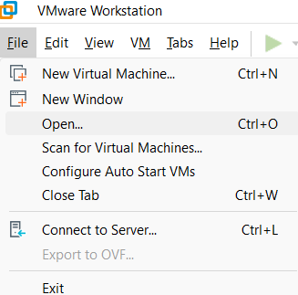  
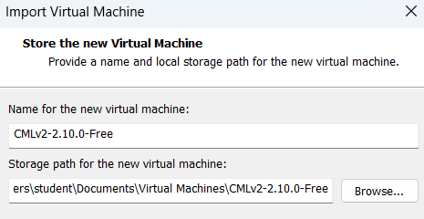  
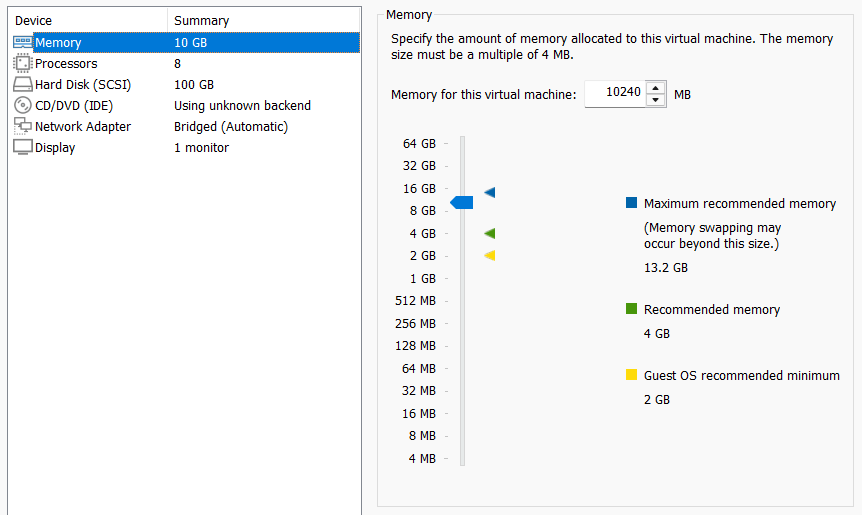  
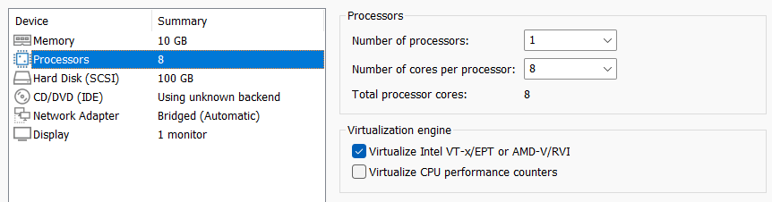  
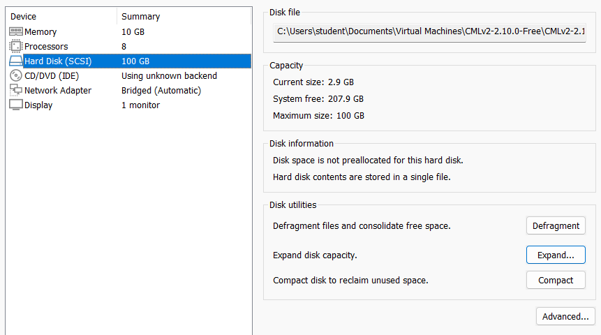  
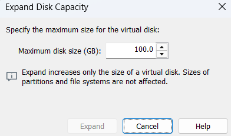  
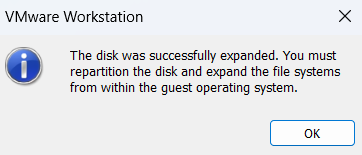  
Төмендегі суретте көрсетілгендей, **refplat-20260409-free.iso** файлды таңдау
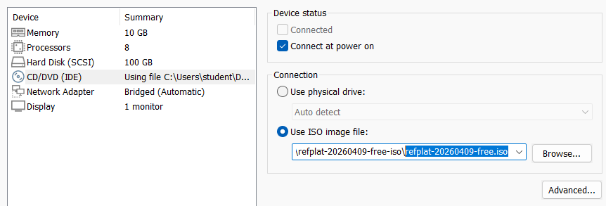  
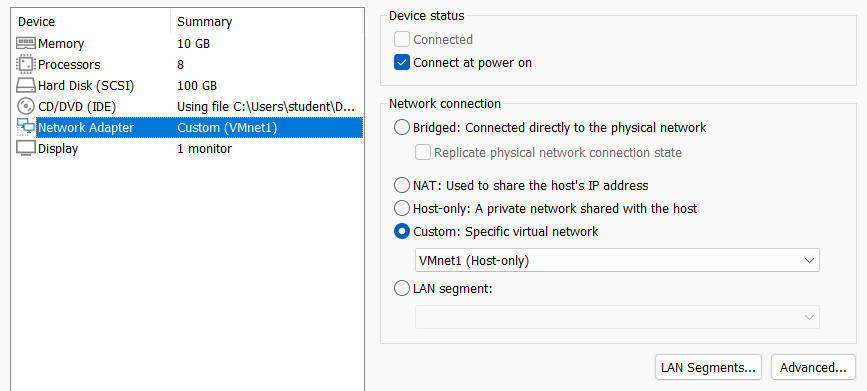  
немесе  
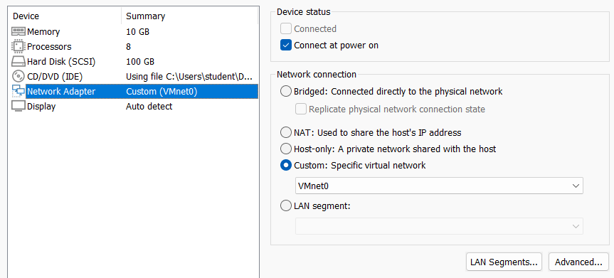  
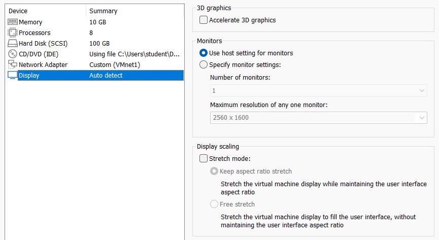  
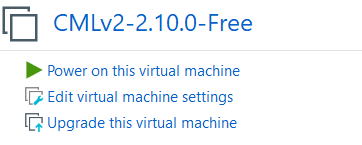  
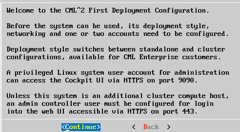  
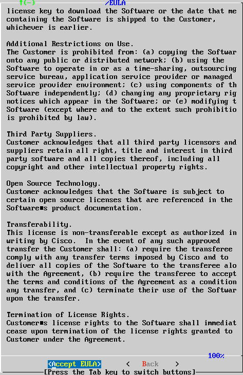  
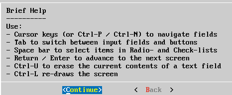  
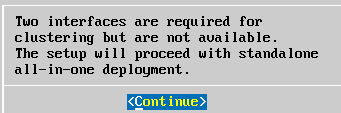  
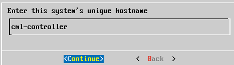  
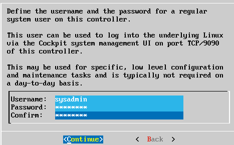  
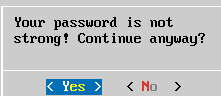  
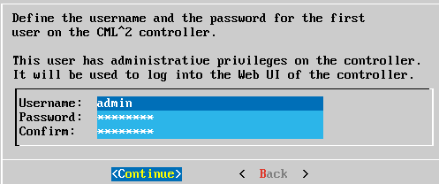  
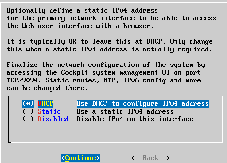  
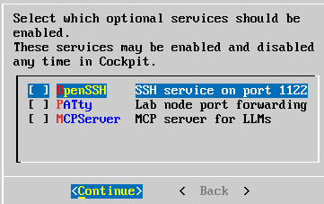  
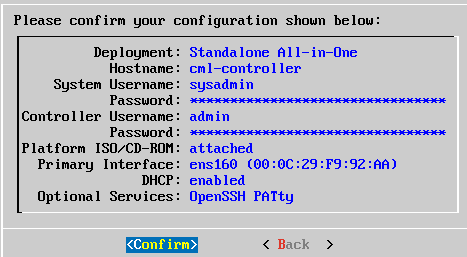  
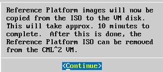  
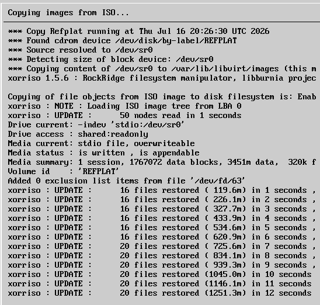  
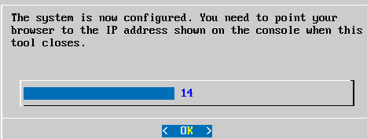  
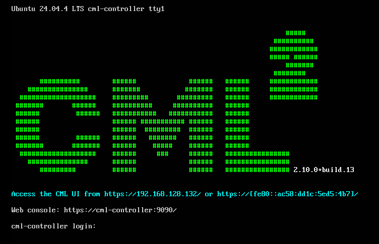  
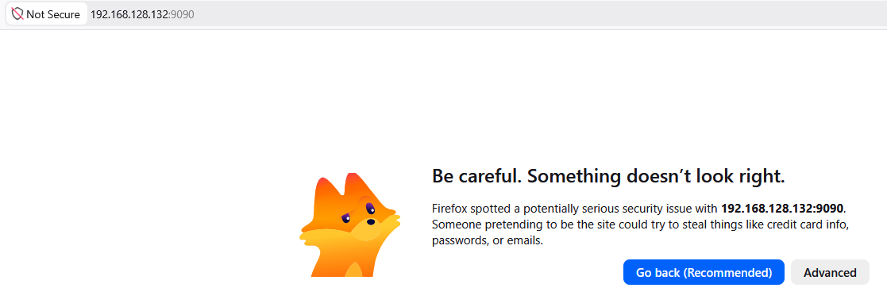  
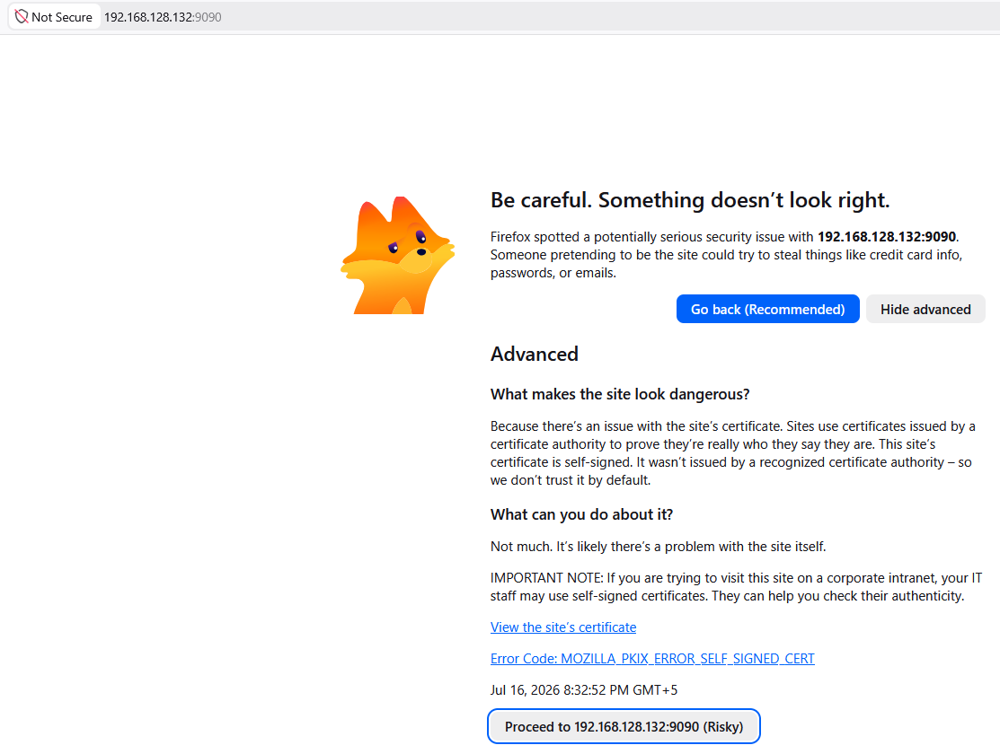  
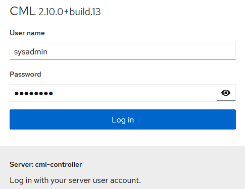  
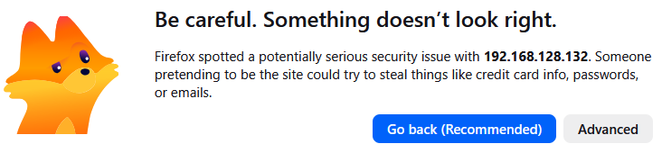  
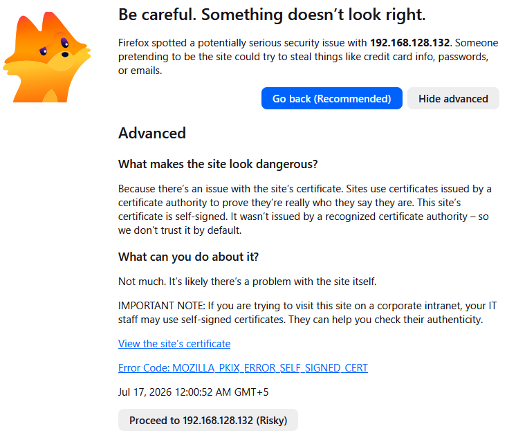  
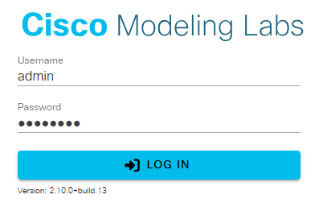  
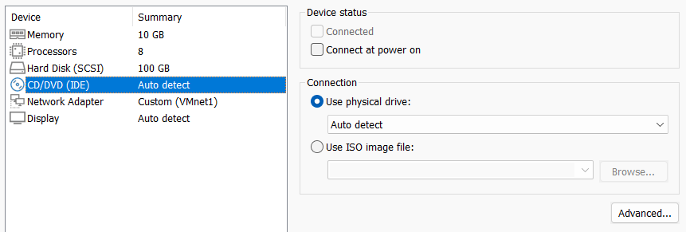  
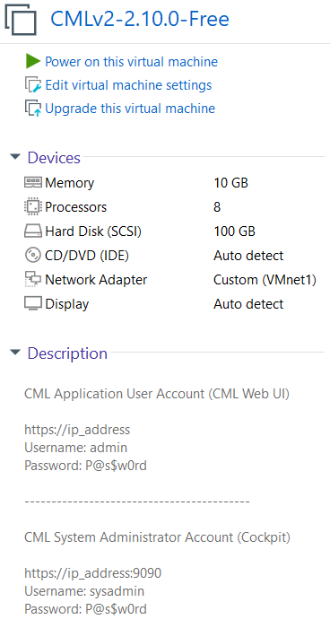  

**7-қадам: Description**  

VMware Workstation -> Description  

```shell
CML Application User Account (CML Web UI)
https://ip_address
Username: admin
Password: P@s$w0rd

------------------------------------------

CML System Administrator Account (Cockpit)
https://ip_address:9090
Username: sysadmin
Password: P@s$w0rd
```

**8-қадам: I Copied It**

> C:\Users\student\Documents\Virtual Machines\CMLv2-2.10.0-Free  

`*.vmx` файлды ашып, төмендегі команданы енгіземіз!  
```shell
uuid.action = "create"
```

**9-қадам: Export to OVF**

  

Нәтижесінде төмендегідей 3 файл құрылады:  
  1) `*.mf`   - Manifest File
  2) `*.vmdk` - Virtual Machine Disk
  3) `*.ovf`  - Open Virtualization Format

**10-қадам: VMware OVF Tool арқылы OVA файл құру**

Download OVF Tool https://developer.broadcom.com/tools/open-virtualization-format-ovf-tool/latest  

Terminal (PowerShell) -> Run as administrator  
```shell
cd "C:\Program Files\VMware\VMware OVF Tool"
.\ovftool.exe --version
```

```shell
cd "$env:USERPROFILE\Documents\Virtual Machines\OVA"
```

```shell
dir
```

OVF to OVA file
```shell
& "C:\Program Files\VMware\VMware OVF Tool\ovftool.exe" `
"CMLv2-2.10.0-Free.ovf" `
"CMLv2-2.10.0-Free.ova"
```
The manifest validates  
Transfer Completed  
Completed successfully  
