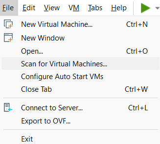

# PNETLab - Network Emulation Platform

**7-қадам: Description**  

VMware Workstation -> Description  

```shell
--- Cisco IOS ---

Router, Switch, Firewall

--- Fortinet ---

# FortiGate
Login: admin
Password: Enter
New Password: Fortinet@123

--- Huawei VRP ---

Router, Switch, Firewall

# Huawei Router AR 1000
Username: super
Password: super
New Password: Huawei@123

# Huawei Firewall USG 6000v
Username: admin
Password: Admin@123
New Password: Huawei@123
```

**8-қадам: I Copied It**

> C:\Users\student\Documents\Virtual Machines\debian-13.6\  

`*.vmx` файлды ашып, төмендегі команданы енгіземіз!  
```shell
uuid.action = "create"
```

**9-қадам: Export to OVF**

  

Нәтижесінде төмендегідей 3 файл құрылады:  
  1) `*.mf`   - Manifest File
  2) `*.vmdk` - Virtual Machine Disk
  3) `*.ovf`  - Open Virtualization Format

**10-қадам: VMware OVF Tool арқылы OVA файл құру**

Download OVF Tool https://developer.broadcom.com/tools/open-virtualization-format-ovf-tool/latest  

Terminal (PowerShell) -> Run as administrator  
```shell
cd "C:\Program Files\VMware\VMware OVF Tool"
.\ovftool.exe --version
```

```shell
cd "$env:USERPROFILE\Documents\Virtual Machines\OVA"
```

```shell
dir
```

OVF to OVA file
```shell
& "C:\Program Files\VMware\VMware OVF Tool\ovftool.exe" `
"PNETLab.ovf" `
"PNETLab.ova"
```
The manifest validates  
Transfer Completed  
Completed successfully  

```shell
dir
```
