# How to install Debian

Table - Minimum System Requirements

| Component | Minimum Requirement |
|-----------|---------------------|
| Processor | 1 GHz single-core   |
| Memory    | 2 GB RAM            |
| Storage   | 20 GB               |

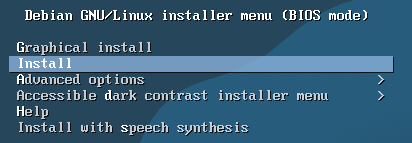

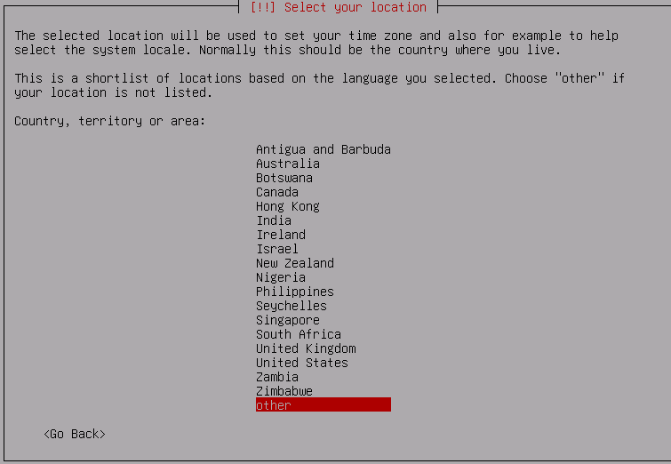

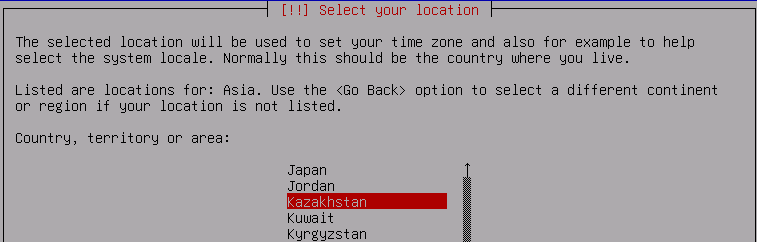

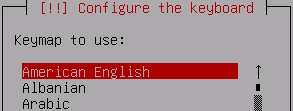
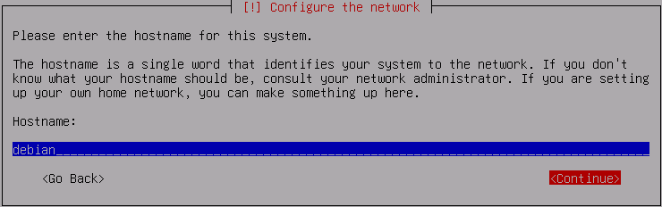
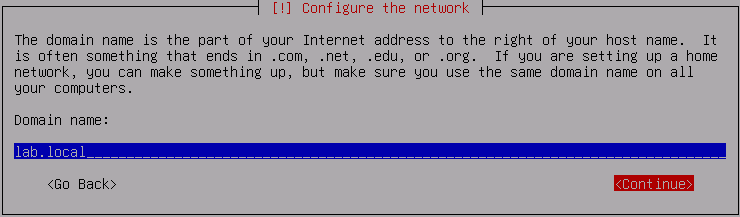
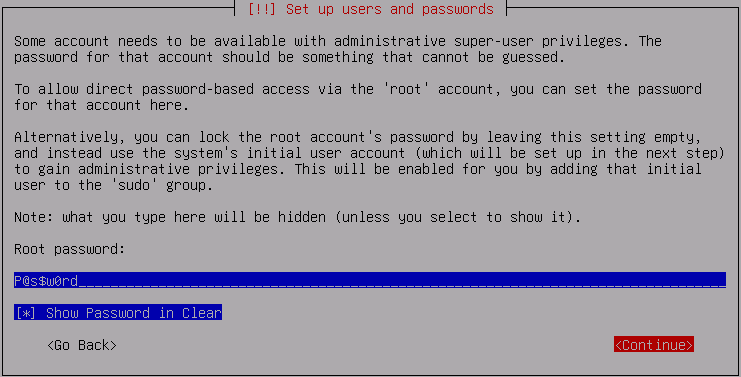
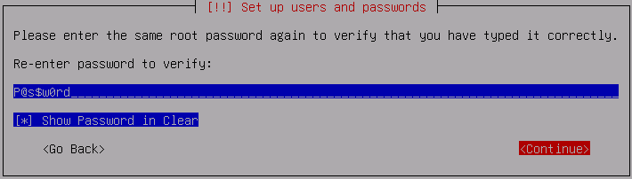

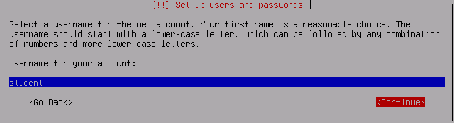

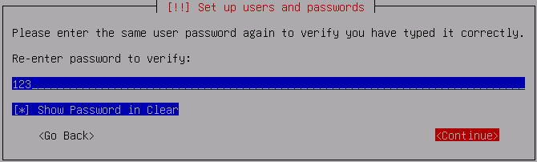
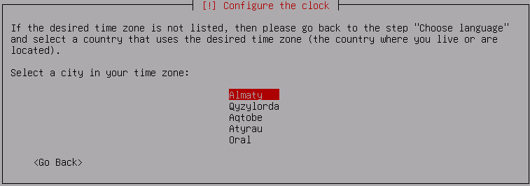

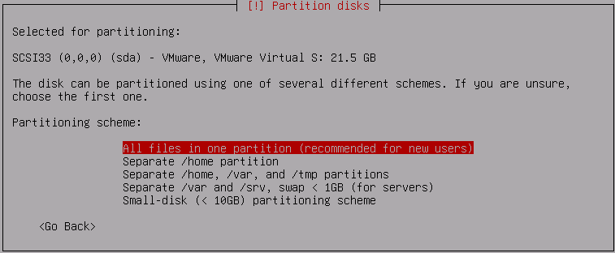
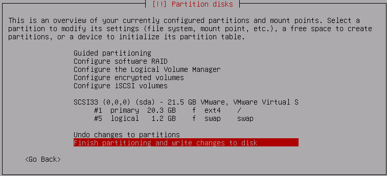

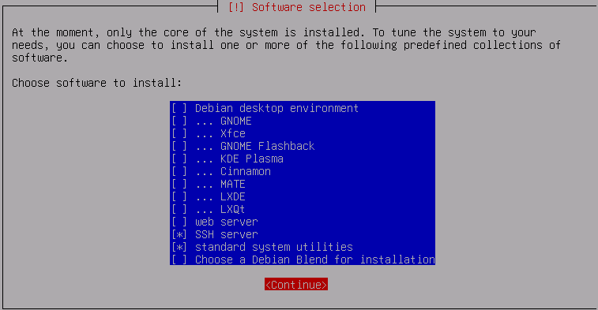

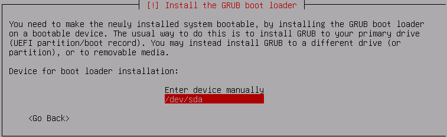
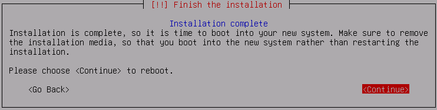
