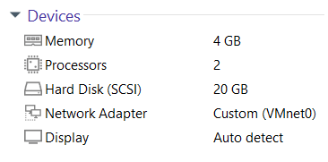
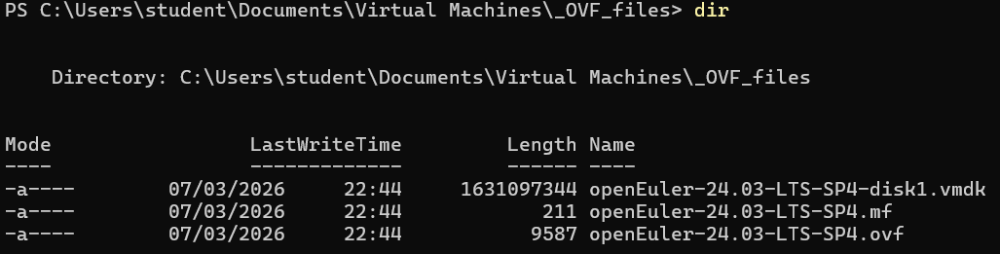
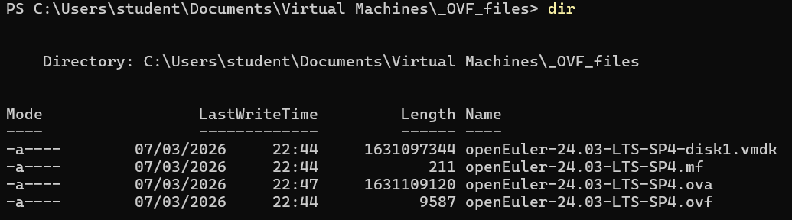

# How to install openEuler 24.03 LTS SP4

**Download VMware Desktop Hypervisor** https://drive.google.com/drive/folders/1xPeOKfdeOzGdEHJRhYktJThgL6-xjkHy?usp=sharing  

**Download openEuler 24.03 LTS SP4** https://www.openeuler.org/en/download/#openEuler%2024.03%20LTS%20SP4  

Table - **Minimum System Requirements**

| Component | Minimum Requirement |
|-----------|---------------------|
| Memory    | 4 GB                |
| Processor | 2 cores             |
| Storage   | 20 GB               |


**Shut Down Guest**  
  

**Hardware Device (RAM, CPU, Storage, NIC, Display)**  
  

login: **student**  
password: **Huawei@123**  

```shell
student@openEuler~$ groups student
student : student wheel
```

```shell
student@openEuler~$ sudo passwd student
password for user student: Huawei@123

New password: 123
Retype new password: 123
```

```shell
student@openEuler~$ sudo passwd root
New password: P@s$w0rd
Retype new password: P@s$w0rd
```

```shell
student@openEuler~$ ping -c2 google.com
```

```shell
student@openEuler~$ sudo dnf clean all
student@openEuler~$ sudo dnf makecache
```

```shell
student@openEuler~$ sudo dnf update -y
```

```shell
student@openEuler~$ sudo reboot
```

```shell
student@openEuler~$ sudo systemctl status sshd

student@openEuler~$ ip address
```

Configure Console Login Banner
```shell
student@openEuler~$ sudo vi /etc/issue
\S \l
Kernel \r

******************************************
Username: student
Password: 123
******************************************
Enter
Enter

:wq
```

Clear Bash History
```shell
student@openEuler~$ history

student@openEuler~$ ls -la
student@openEuler~$ cat /dev/null > ~/.bash_history
student@openEuler~$ history -c
```

Shut Down Guest  


**Description**  

VMware Workstation -> Description  

Username: student  
Password: 123  

Username: root  
Password: P@s$w0rd  

**10-қадам: I Copied It**

`*.vmx` файлды ашып, төмендегі команданы енгіземіз!  
```shell
uuid.action = "create"
```
> C:\Users\student\Documents\Virtual Machines\openEuler-24.03-LTS-SP4  

**11-қадам: Export to OVF**

  

Нәтижесінде төмендегідей 3 файл құрылады:  
  1) `*.mf`   - Manifest File
  2) `*.vmdk` - Virtual Machine Disk
  3) `*.ovf`  - Open Virtualization Format

**12-қадам: VMware OVF Tool арқылы OVA файл құру**

Download OVF Tool https://developer.broadcom.com/tools/open-virtualization-format-ovf-tool/latest  

Terminal (PowerShell) -> Run as administrator  
```shell
cd "C:\Program Files\VMware\VMware OVF Tool"
.\ovftool.exe --version
```

```shell
cd "$env:USERPROFILE\Documents\Virtual Machines\_OVF_files"
```

```shell
dir
```


OVF to OVA file
```shell
& "C:\Program Files\VMware\VMware OVF Tool\ovftool.exe" `
"openEuler-24.03-LTS-SP4.ovf" `
"openEuler-24.03-LTS-SP4.ova"
```
The manifest validates  
Transfer Completed  
Completed successfully  

```shell
dir
```


**13-қадам: Take Snapshot**  
  
Snapshot Manager -> Take Snapshot -> Name: initial image  
