# How to install Ubuntu Server 24.04.4 LTS

**Download VMware Desktop Hypervisor** https://drive.google.com/drive/folders/1xPeOKfdeOzGdEHJRhYktJThgL6-xjkHy?usp=sharing  

**Download Ubuntu Server** https://ubuntu.com/download/server  

Table - **System Requirements**

| Component | Minimum Requirement |
|-----------|---------------------|
| Memory    | 2 GB                |
| Processor | 2 cores             |
| Storage   | 20 GB               |


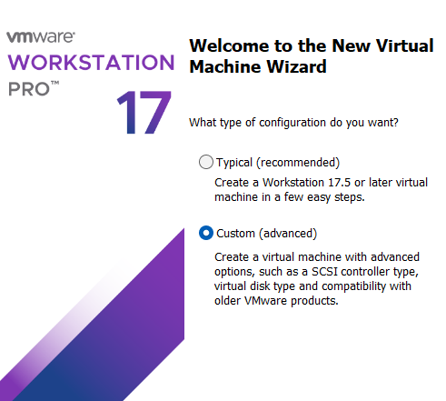  
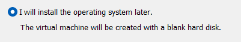  
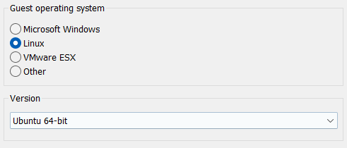  
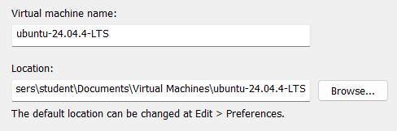  
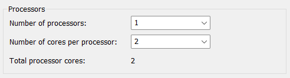  
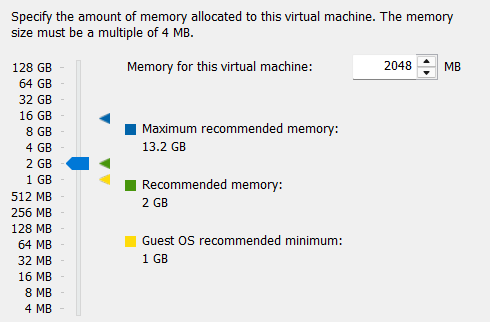  
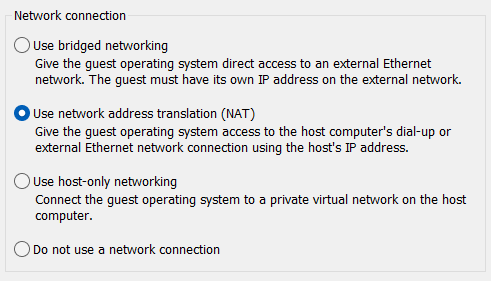  
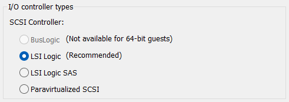  
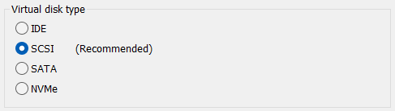  
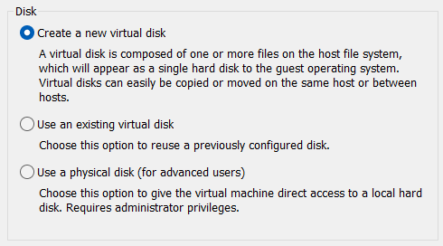  
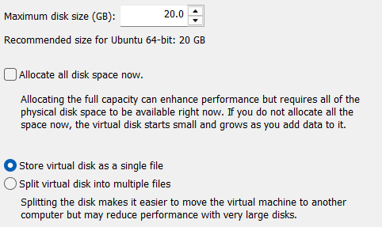  
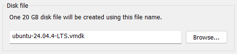  
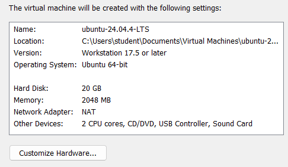  
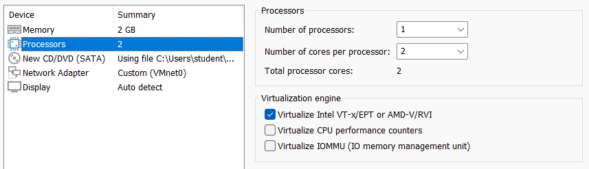  
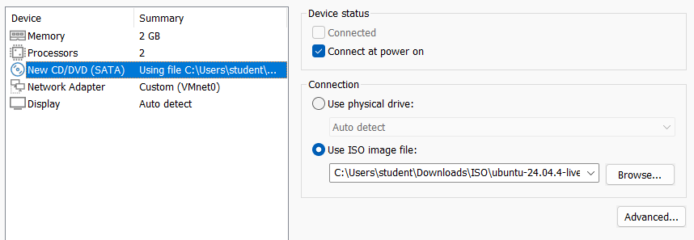  
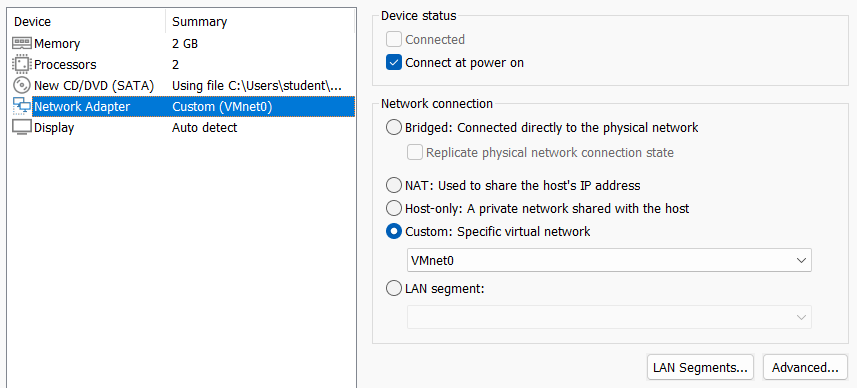  
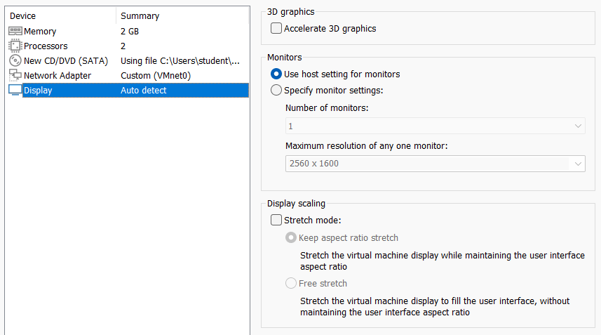  

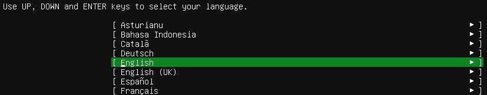  
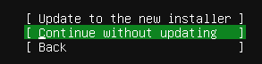  
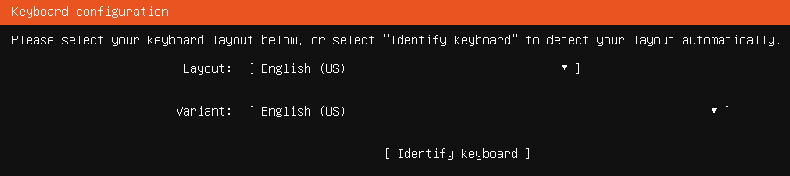  
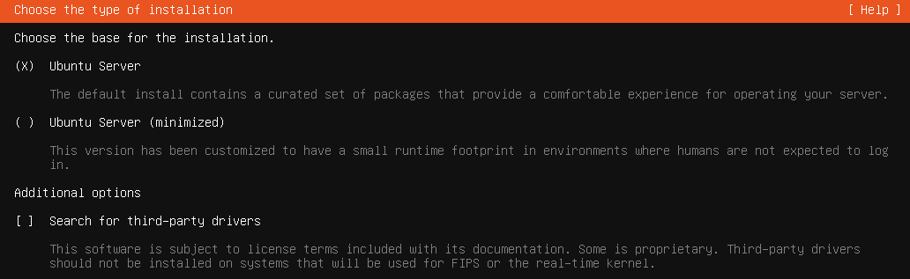  
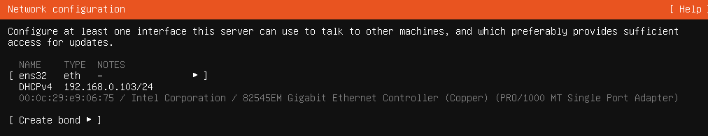  
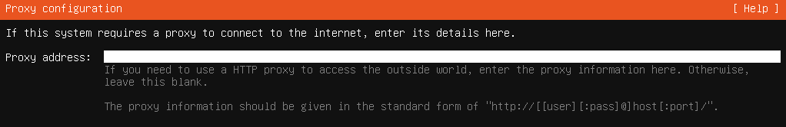  
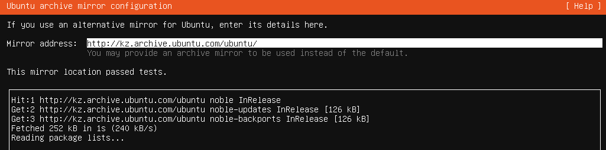  
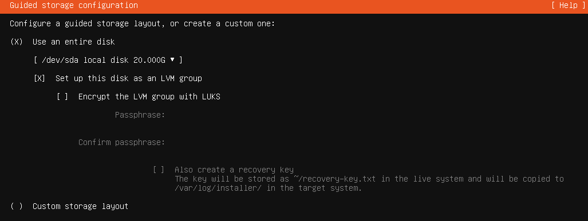  
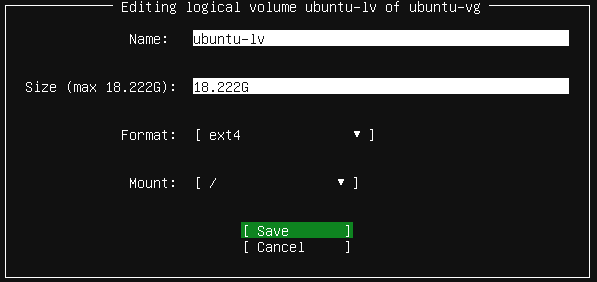  
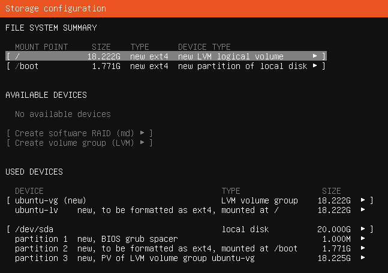  
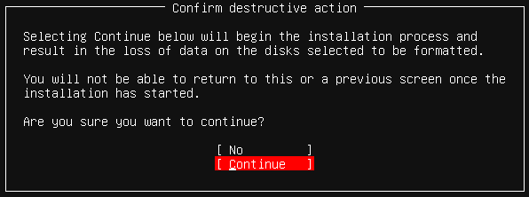  
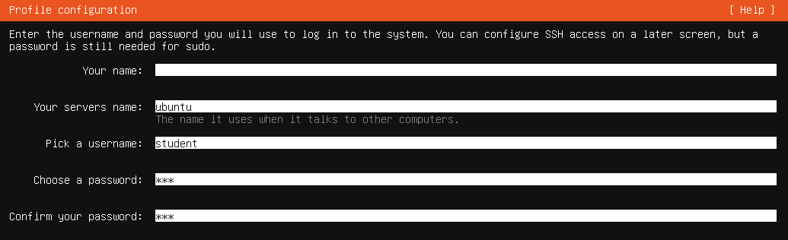  
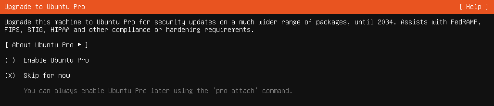  
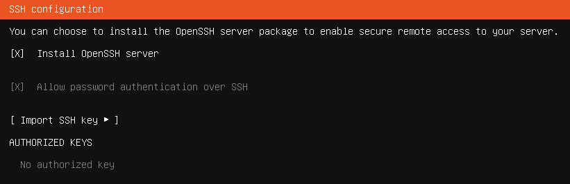  
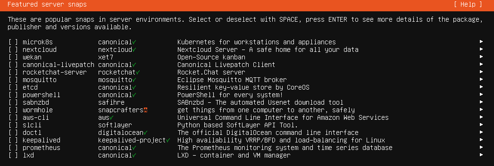  
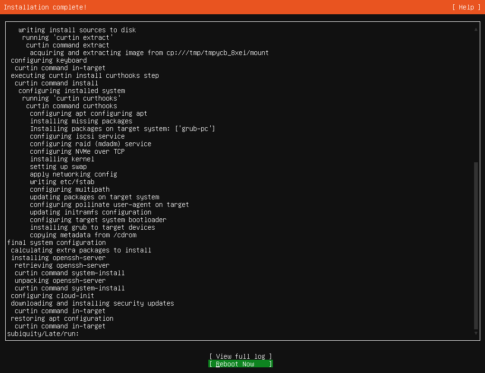  
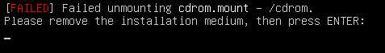  

**Shut Down Guest**  
  

**Hardware Device (RAM, CPU, Storage, NIC, Display)**  
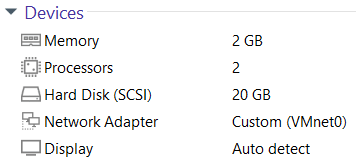  

**1-қадам: Set the Root Password**

login: **student**  
password: **123**  

```shell
student@ubuntu:~$ groups student
```

```shell
student@ubuntu:~$ sudo passwd root
New password: P@s$w0rd
```

**2-қадам: Update and Upgrade**
```shell
student@ubuntu:~$ ping google.com -c2

student@ubuntu:~$ sudo apt update
student@ubuntu:~$ sudo apt upgrade -y
```

```shell
student@ubuntu:~$ reboot
```

**3-қадам: System Information**
```shell
student@ubuntu:~$ uname -sr
student@ubuntu:~$ lsb_release -a
```

**4-қадам: Verify SSH Connectivity**
```shell
student@ubuntu:~$ sudo systemctl status ssh

student@ubuntu:~$ ip address
```

**5-қадам: Configure Console Login Banner Message**

```shell
student@ubuntu:~$ sudo nano /etc/issue
\S \l
Kernel \r

************************
Username: student
Password: 123
************************
ENTER
ENTER

CTRL+O, ENTER, CTRL+X
CTRL+L
```
`\S` - OS name  
`\l` - TTY name  
`\r` - Kernel release  

```shell
student@ubuntu:~$ logout
```

**6-қадам: optional: true**

```shell
student@ubuntu:~$ sudo nano /etc/netplan/50-cloud-init.yaml
network:
  version: 2
  ethernets:
    ens32:
      dhcp4: true
      optional: true

CTRL+O, ENTER, CTRL+X
CTRL+L

student@ubuntu:~$ sudo netplan apply
```

**7-қадам: Clear Bash History**

```shell
student@ubuntu:~$ history

student@ubuntu:~$ ls -la
student@ubuntu:~$ cat /dev/null > ~/.bash_history
student@ubuntu:~$ history -c
```

**Shut Down Guest**  
  

**8-қадам: Description**  

VMware Workstation -> Description  

Username: student  
Password: 123  

Username: root  
Password: P@s$w0rd  

**9-қадам: I Copied It**

> C:\Users\student\Documents\Virtual Machines\ubuntu-24.04.4-LTS\  

`*.vmx` файлды ашып, төмендегі команданы енгіземіз!  
```shell
uuid.action = "create"
```

**10-қадам: Export to OVF**

  

Нәтижесінде төмендегідей 3 файл құрылады:  
  1) `*.mf`   - Manifest File
  2) `*.vmdk` - Virtual Machine Disk
  3) `*.ovf`  - Open Virtualization Format

**11-қадам: VMware OVF Tool арқылы OVA файл құру**

Download OVF Tool https://developer.broadcom.com/tools/open-virtualization-format-ovf-tool/latest  

Terminal (PowerShell) -> Run as administrator  
```shell
cd "C:\Program Files\VMware\VMware OVF Tool"
.\ovftool.exe --version
```

```shell
cd "$env:USERPROFILE\Documents\Virtual Machines\OVF_files"
```

```shell
dir
```


OVF to OVA file
```shell
& "C:\Program Files\VMware\VMware OVF Tool\ovftool.exe" `
"ubuntu-24.04.4-LTS.ovf" `
"ubuntu-24.04.4-LTS.ova"
```
The manifest validates  
Transfer Completed  
Completed successfully  

```shell
dir
```


**12-қадам: Take Snapshot**  
  
Snapshot Manager -> Take Snapshot -> Name: initial image  
